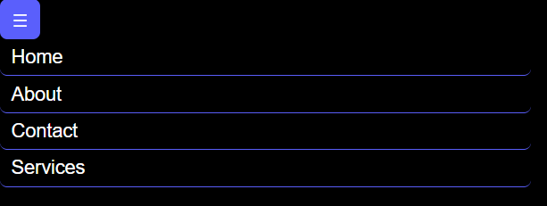
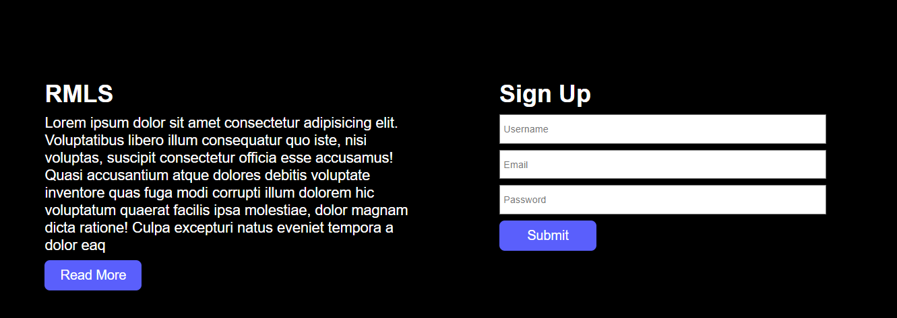

This project is a short and simple example of useContext hook in React.  

## Components
- Navbar component -> Navigation bar component. On screen widths below 800px the nav items will not be shown by default, instead a toggle icon will be there. Upon toggling it the entire nav menu will be displayed like this.

On screen width greater than 800px, the navbar is as shown below

- Login Component -> Its composed of two parts, the first one is a simple description component and the second part is a simple form. Following controls have been implemented.
  - The user will not be able to submit until each of username, password and email fields have been populated.
  - Each of the user credentials will be stored in state and this state will be further used via **context** in Profile Component.

**The button component is a reusable react component**